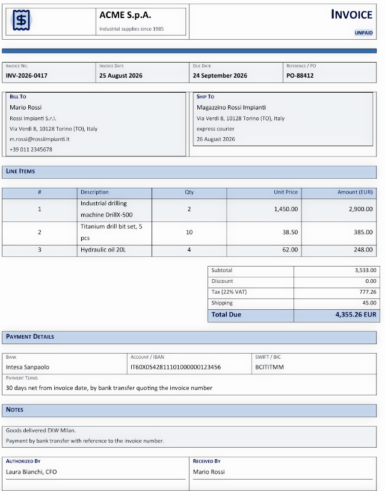
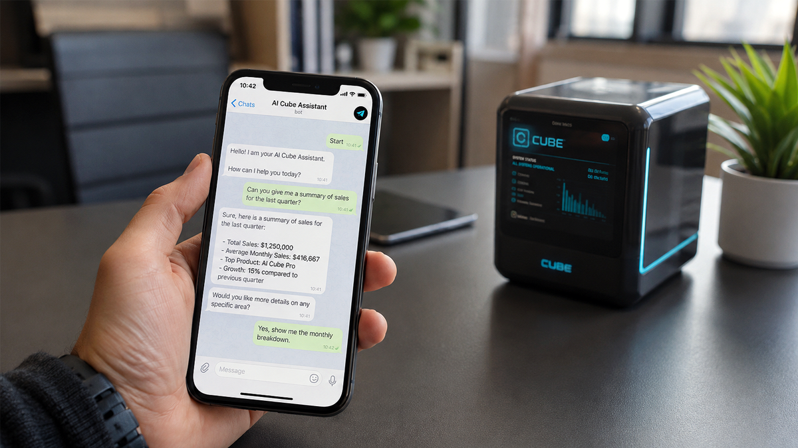
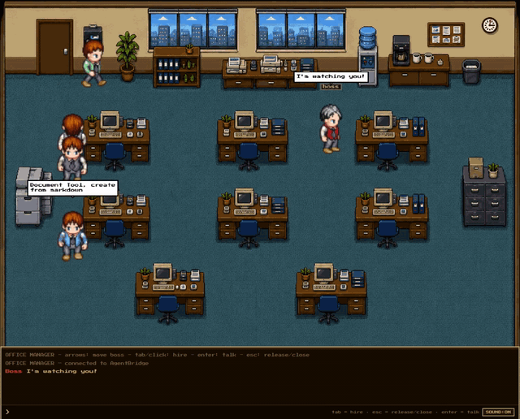

# Mac Studio AI Agent

[](https://raw.githubusercontent.com/Graphene-Lab/Mac-Studio-AI-Agent/main/install.sh)
[](https://github.com/Graphene-Lab/AgentBridge/releases/latest)


> **Mac Studio AI Agent turns your Mac into a private, self-hosted AI office assistant.** Built on [AgentBridge](https://github.com/Graphene-Lab/AgentBridge), it reads your documents, writes office files, manages email, researches the web, speaks with a neural voice, chats on Telegram, schedules tasks and even produces podcasts — while your data stays on your Mac and never reaches a cloud.

**Mac Studio AI Agent** is the ready-to-run configuration of **AgentBridge** for the **Apple silicon Mac family** — with the **Mac Studio (M5 Max / M5 Ultra)** as its flagship. Apple's own philosophy has always been "what happens on your Mac, stays on your Mac": powerful hardware with a dedicated Neural Engine, unified memory and on-device AI. The Mac Studio AI Agent brings that same philosophy to a full **AI office assistant**: an always-on colleague that drafts contracts and invoices, builds spreadsheets, prepares slide presentations, produces detailed PDF reports, handles your email, remembers facts and deadlines, and keeps working while you are away — **100% private, on hardware you own.**

## Why run your AI on a Mac?

Most AI assistants live in the cloud: you send them your documents, and a company you do not control reads them. The Mac Studio AI Agent inverts that model. The intelligence runs on your own Apple silicon — a Mac Studio on your desk, a MacBook Pro on the road, an iMac in the office — where the **Neural Engine** and the fast **unified memory** of the M-series chips run local models comfortably, with no GPU card and no cloud bill.

The result is the best of both worlds. You get the productivity of a modern agentic AI — planning, tool use, long-term memory — with the privacy of a local appliance. There is no subscription tied to your data, no third party holding your archive, and no monthly fee per seat. You buy the hardware once, and the assistant works for you day and night.

## Key capabilities

- **Your documents, understood** — point the assistant at your documents folder and it indexes everything: contracts, invoices, client files, product sheets, emails, spreadsheets. You then ask questions and it answers from *your* material, not from guesses.
- **Finished office documents from a prompt** — describe an invoice, an employment contract, a workbook with data and charts, a slide deck or a market analysis, and the agent delivers the finished **DOCX, XLSX, PPTX or PDF**.
- **Email under your control** — the assistant reads and summarises your inbox and drafts replies, sending only what you approve, through your own account (SMTP/IMAP).
- **Web research with sources** — current facts, competitor reviews and research reports with verifiable citations, blended with your own files.
- **A voice of its own** — neural text-to-speech (Kokoro) is included out of the box and runs on any Mac; you can hear the answers spoken. Microphone dictation is Windows-only today — macOS speech recognition is on the roadmap (see the [technical notes](TECHNICAL-NOTES.md)).
- **Reachable by phone (SIP)** — a Mac can become a phone endpoint with a PIN-protected voice line. The SIP engine is cross-platform; phone access on macOS needs the speech-recognition component and is planned for a future release (see the [technical notes](TECHNICAL-NOTES.md)).
- **On Telegram** — chat with the assistant from your messenger, with files in both directions and an allow-list that decides who can talk to it.
- **Autonomous scheduling** — deadlines, recurring reports and follow-ups that the assistant plans and executes by itself.
- **Podcast production** — ask for a podcast on any topic and receive a ready-to-publish MP3 with its RSS feed.
- **A memory that never forgets** — deterministic memory brings back the facts, people and documents the assistant has already handled, instantly and precisely.
- **Watch your AI team work** — OfficeManager turns every running agent into an employee in a live 16-bit office where you can watch, nudge and hire the agents working for you.

## See it in action

The terminal chat, streaming the assistant's reply word by word, with the command palette and the status bar that follows the server, the model, the session and the context window:

[](media/demo.mp4 "Watch the video")

PowerPoint-style presentations designed by the assistant from a plain request:


Detailed PDF market and financial analysis reports with authoritative sources:

[](media/enanced_doc_demo.mp4 "Watch the video")

Real office documents produced from a prompt — an invoice ready to use:



An employment contract in Word format, written and laid out entirely by the assistant:


An Excel spreadsheet with data, styles and a chart on a single A4 page:


A complete podcast episode — research, script and narration — produced by the assistant. Click to play:

[](media/podcast-example.mp4)

And the same assistant on Telegram, replying inside your messenger:



Every demo above was produced end-to-end by the assistant on the AgentBridge engine — the very same engine that runs on your Mac.

## OfficeManager — watch your AI team work

OfficeManager is the visual layer of your agent: a live, 16-bit top-down office where **every agent instance becomes an employee**. Open `http://localhost:5290/OfficeManager` in any browser on your Mac and you see the assistant's work as it happens — an idle employee roams the floor ("I have nothing to do"), an agent answering your chat sits at a desk with its current tool in the speech bubble, and every subagent your request spawns walks in, works and leaves in real time.

You can **hire** an employee with Tab or a click to start a conversation, **release** it with Esc, and type prompts in the bottom chat — chatting with an idle employee spawns a brand-new agent for that conversation. The boss is your avatar: walk it around, keep an eye on the team, and let it roam in auto-pilot while the agents do the heavy lifting:

[](media/office-manager-demo.mp4 "Watch the video")

OfficeManager is part of AgentBridge and ships with it — no extra install. It works in any modern browser and never calls external services: everything stays on your Mac.

## Supported Apple hardware

The Mac Studio AI Agent runs on **any Apple silicon Mac** (M1, M2, M3, M4 and M5 generations — every chip with a dedicated Neural Engine), and it is tuned and documented primarily for the **Mac Studio**:

| Device | Notes |
|---|---|
| **Mac Studio** (flagship) | **M5 Max / M5 Ultra** — 16- and 32-core Neural Engine, up to 128/512 GB of unified memory, up to 1.2 TB/s memory bandwidth: the ideal always-on AI office appliance on your desk |
| **MacBook Pro** | The same assistant, portable — local models on Apple silicon |
| **MacBook Air** | Fanless, silent AI office assistant for everyday work |
| **iMac** | The all-in-one desktop that runs the agent next to your documents |
| **Mac mini** | A small, quiet home server for the agent, always on |
| **Mac Pro** | The workstation class, for the heaviest local models and parallel work |

All of them share the same advantages: a **Neural Engine** dedicated to on-device AI, **unified memory** that lets local models use a large part of the machine's RAM, and **Metal**-accelerated LLM inference through local runtimes such as Ollama. Because the whole stack is native macOS — Apple silicon **and** Intel, through the matching release archive — a Mac with a large unified-memory configuration can run surprisingly capable local models while remaining fully private.

*Intel Macs with macOS 12 or later are also supported through the `osx-x64` build of AgentBridge — the installer picks the right archive automatically.*

The same software stack also runs on Windows, Linux desktops and ARM single-board computers (from Rockchip RK3588 boards up to an NVIDIA Grace Blackwell) — ask the [AgentBridge documentation](https://github.com/Graphene-Lab/AgentBridge) for the full list.

## Getting started
**Install on any Apple silicon Mac (macOS 12+) — one copy-paste command in Terminal.** The installer downloads the macOS release that matches your Mac (Apple silicon or Intel), unpacks it, and registers the assistant as a background service that starts at boot. No .NET runtime, no manual steps.

```bash
curl -fsSL https://raw.githubusercontent.com/Graphene-Lab/Mac-Studio-AI-Agent/main/install.sh | bash
```

*Prerequisites: a Mac with macOS 12 or later, at least 1.5 GB free storage, and a terminal with `sudo` (the installer can also unpack without installing a service — see the [installation guide](INSTALL.md)). Full details, options and troubleshooting are in the [installation guide](INSTALL.md).*

After the install the assistant is already running. Verify it, then choose the AI that powers it — type `/modelsetup` in the chat and pick a **local model** via Ollama (native Metal acceleration on Apple silicon — everything stays on your Mac, fully offline), or a **cloud provider** such as DeepSeek, Gemini or Anthropic (maximum power, with built-in GDPR-ready anonymisation that strips names and identifiers before any request leaves your Mac). Common questions are answered in the [FAQ](FAQ.md).

## The user guides

The repository ships a complete series of plain-language guides, one for each aspect of the assistant. Each guide is short, written for the end user, and can be read on its own.

| Guide | What it covers |
|---|---|
| [01 · Getting started](01-Getting-Started.md) | Download, first start, the first indexing |
| [02 · Choosing your AI](02-Choosing-Your-AI.md) | Cloud and local providers, API keys, switching |
| [03 · Chatting with your agent](03-Chatting-with-Your-Agent.md) | The chat window, files, sessions, the web version |
| [04 · Your documents area](04-Your-Documents-Area.md) | The folder the agent reads, indexing, asking questions |
| [05 · Creating documents](05-Creating-Documents.md) | Word, Excel, PowerPoint and PDF from a request |
| [06 · Email](06-Email.md) | Reading and sending mail with your account |
| [07 · Web research](07-Web-Research.md) | Searching the internet, sources and reports |
| [08 · Voice](08-Voice.md) | Hearing the assistant speak (dictation on macOS: roadmap) |
| [09 · Phone access](09-Phone-Access.md) | Calling the assistant, the PIN, voice calls |
| [10 · Telegram](10-Telegram.md) | Chatting with the assistant in Telegram |
| [11 · Scheduled tasks](11-Scheduled-Tasks.md) | Deadlines and recurring work the agent does alone |
| [12 · Podcasts](12-Podcasts.md) | Complete podcast episodes from one request |
| [13 · Privacy and security](13-Privacy-and-Security.md) | The sandbox, anonymisation, what leaves your Mac |
| [14 · The agent's memory](14-The-Agents-Memory.md) | How the assistant remembers your work |
| [15 · Updates](15-Updates.md) | How updates work and what they never touch |

## Privacy and security

The Mac Studio AI Agent applies the same security model as AgentBridge, which is enforced by the program's own structure and not by instructions that a crafted message could bypass.

- **Application-level sandbox** — the assistant acts only through a small set of approved tools: it can read your documents, create files, send email and browse the web, but it cannot run arbitrary commands or touch anything outside its workspace.
- **Data stays on your Mac** — with a local model, nothing leaves the machine at all. The only task that reaches the internet is web research, by design, and your documents are never sent along.
- **GDPR-ready anonymisation** — when you use a cloud provider, names, keys and sensitive identifiers are replaced before any request leaves your Mac and restored seamlessly in the reply.
- **An update never touches your data** — automatic updates replace only the program files; your documents, keys and configuration are protected by design.

## Frequently asked questions

**What exactly is the Mac Studio AI Agent?** It is a self-hosted AI assistant: AgentBridge running natively on your Mac — a private server that automates office work — documents, spreadsheets, email, presentations, web research, phone and messaging — under your full control, with no data leaving your machine.

**Which Macs does it support?** Every Apple silicon Mac — Mac Studio, MacBook Pro, MacBook Air, iMac, Mac mini and Mac Pro, from the M1 generation to the latest M5 chips (all equipped with a dedicated Neural Engine) — plus Intel Macs with macOS 12 or later through the Intel build. The Mac Studio (M5 Max / M5 Ultra) is the reference configuration.

**How is it different from a chatbot or an MCP server?** A chatbot only answers in a chat window. The Mac Studio AI Agent plans, uses tools, produces finished files and acts on its own schedule. Compared with traditional MCP setups, tools run natively inside the application sandbox with no separate servers or interpreters. The [AgentBridge white paper](https://github.com/Graphene-Lab/AgentBridge/blob/master/docs/AIORCHESTRATOR-WHITEPAPER.md) explains the architecture.

**Does it need an internet connection?** No. With a local model (Ollama on Apple silicon), the assistant works fully offline. A connection is only needed to download updates, to browse the web for research, or when you explicitly choose a cloud provider.

**Do my documents leave my Mac?** No. The documents area is a plain folder that the assistant reads directly. Only the model call can leave the machine, and only when you pick a cloud provider — with anonymisation applied by default.

**Which AI models can I use?** Any. Local models via Ollama (Metal-accelerated on Apple silicon) or any OpenAI-compatible local server, cloud providers such as DeepSeek, Z.ai, Gemini and Anthropic, or any OpenAI-compatible endpoint. You can switch at any time with a single command.

**Can my Mac really run local models?** Yes. Apple silicon unifies CPU, GPU and Neural Engine over a single pool of memory, so a Mac with 64, 128 or 512 GB of unified memory can run far larger local models than most laptops — and the Neural Engine accelerates the on-device AI workload. The speech engine runs on the CPU with no special requirements.

**How do I update it?** Automatically. At every start the assistant checks for a newer release, installs it and restarts — while never touching your documents, keys or settings. Updates can be turned off from the menu if you prefer.

**Is it free?** The software is released as open source for personal use under the [Andrea Bruno License 1.4](LICENSE.md). Commercial use of the code requires a royalty agreement with the author, as stated in the license.

## Comparison with alternatives

| Product | Where it runs | Your data | Office tools | Phone & messaging |
|---|---|---|---|---|
| **Mac Studio AI Agent** | Your own Mac, on your desk | Stays on your Mac | Documents, spreadsheets, slides, PDF | SIP phone + Telegram |
| **Cloud AI assistants** | Vendor's servers | Read by the vendor | Chat-based, limited | Usually none |
| **Proactive SaaS agents** | Vendor's cloud | Synced to vendor | Task workflows | Limited |

The Mac Studio AI Agent is the only option that combines an autonomous, tool-using agent with Apple hardware you own, a flat cost, and the certainty that your archive never leaves the building.

## Documentation and resources

- [Installation guide](INSTALL.md) — prerequisites, options, verification, updates, uninstall, troubleshooting
- [Frequently asked questions](FAQ.md) — installation, usage, speech, privacy
- [Technical notes](TECHNICAL-NOTES.md) — macOS platform status and roadmap (speech recognition, phone access, system voices)
- [AgentBridge repository](https://github.com/Graphene-Lab/AgentBridge) — the engine your Mac runs
- [AgentBridge user manual](https://github.com/Graphene-Lab/AgentBridge/blob/master/docs/MANUAL.md) — installation and configuration reference
- [AgentBridge white paper](https://github.com/Graphene-Lab/AgentBridge/blob/master/docs/AIORCHESTRATOR-WHITEPAPER.md) — why the library model outperforms MCP deployments
- [Graphene-Lab](https://github.com/Graphene-Lab) — the organisation behind the project

## License

[Andrea Bruno License 1.4](LICENSE.md) — open source for personal, educational and research use; commercial use requires a royalty agreement with the author.
